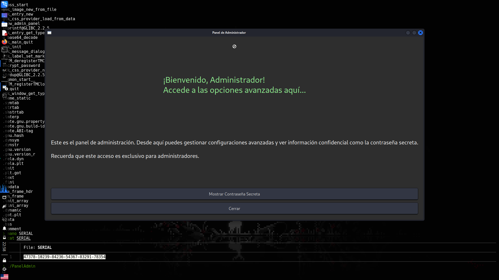

>[Maquina](https://mega.nz/file/iJ1UzQ5C#t8zsjmsyIB6dIFndUVc6qrvZOOh2cevCDNvEgUOELWs)   \   [Dockerlabs](https://dockerlabs.es/)

## Reconocimiento

Comenzamos haciendo un escaneo con `nmap` sobre todos los puertos de la maquina para determinar cuales se encuentran abiertos.

`Nmap` determina que el puerto **22** y **80** se encuentra abiertos.
El puerto `22` corresponde a un servico *ssh*, y el puerto `80` corresponde a un servicio *http*(servicio web).

Ahora efectuamos un segundo escaneo con `nmap` para reconocer y determinar versiones de los servicios que corren dentro de estos dos puertos.

No hay mayor cosa en los resultados del escaneo asi que pasamos a revisar la web del puerto **80**.

Si observamos bien, en la parte inferior vemos un nombre que tiene toda la pinta de ser un dominio.

Al contemplarlo en el */etc/hosts*, se nos mostrara una web completamente diferente.

En la web no hay nada de que abusar, ni usando fuzzing podemos encontrar algo interesante asi que pasamos a buscar posibles subdominios con ayuda de `wfuzz`.

Al parecer existe un subdominio *japan* para **cracker.dl** por lo que lo agregaremos al */etc/hosts* y veremos que contiene.

Dentro de la pagina vemos que nos piden la introduccion de un SERIAL para acceder a un Panel de Administrador y podemos descargar un programa que seria aparentemente el Panel de Administracion.

Al igual que la web anterior no hay nada interesante, ni usando fuzzing encontramos algo asi que, nos quedaremos solo con el analisis del software que acabamos de descargar.

Al ejecutar el programa es de esperarnos que nos pida el SERIAL o una contraseña. Y efectivamente.

Pero hay cosas que debemos tomar encueta.

## Explotacion

Podriamos leer o descomponer el programa/software en busca de alguna credencial que no este bien guardada o encriptada dentro del programa ya que, de algun lugar tiene que verificar el valor que ingresemos como SERIAL por lo que probablemete este almacenado ahi dentro.

Para no complicarnos mucho usaremos directamente el comando `strings` para leer solo palabras dentro del binario pero hay programas mas potentes como `ghidra` para decomponer por completo el programa.

Podemos obervar un par de numeros que tienen toda la pinta de ser una credencial o algo por el estilo por lo que los podriamos usar para ver si nos permite ingresar al programa que hemos descargado.

Una vez dentro, se nos permite ver una contraseña super secreta por lo que la leeremos.

Esta contraseña es muy probable que sea para podernos conectar via **ssh** por lo que la podemos probar.

Despues de probar un poco, hemos logrado entrar como el usuario *cracker*.

> la contraseña lleva un cero, no una "o", por ese despiste perdi tiempo.

## Escalada de Privilegios

Si revisamos permisos sudoers, no tenemos, si buscamos permisos SUID, no hay, y si buscamos por capabilities, no hay nada, si buscamos usuarios, solo estan cracker y root.

Aparentemente no hay nada asi que antes de ponernos a buscar mas en profundidad podriamos intentar usar las credenciales que tenemos hasta ahorita.

Al usar la contraseña de cracker, no funciona, pero y si usamos el SERIAL?

Buen comienzo de año.

