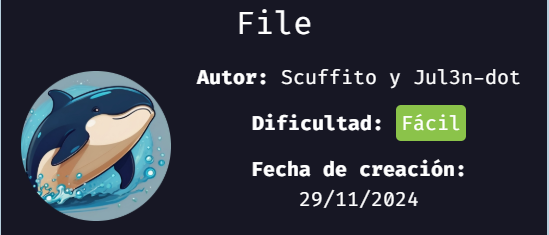

>[Maquina](https://mega.nz/file/yAUAGKbJ#yDt6iFURxBS-0ZZinTSXuNPM0HtOfkxvOTqXAw63lp8)   \   [Dockerlabs](https://dockerlabs.es/)

## Reconocimiento
Comenzamos haciendo un escaneo con `nmap` sobre todos los puertos de la maquina para determinar cuales se encuentran abiertos.

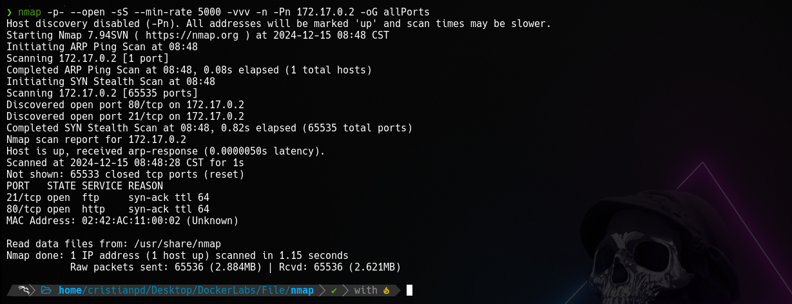

`Nmap` determina que el puerto **21** y **80** se encuentra abiertos.
El puerto `21` corresponde a un servico *ftp* (file transfer protocol), y el puerto `80` corresponde a un servicio *http*(servcio web).

Ahora efectuamos un segundo escaneo con `nmap` para reconocer y determinar versiones de los servicios que corren dentro de estos dos puertos.

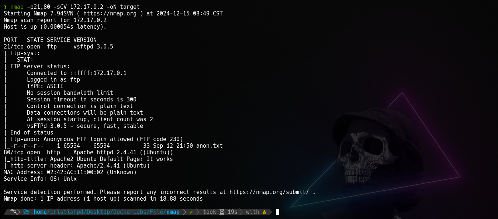

Podemos ver en los resultados que en el puerto `21`(*ftp*), tenemos acceso como *anonymous* a un archivo *anon.txt*.

Por otro lado, si revisamos el puerto `80` en el navegador, solo observamos una web que viene por defecto en los sistemas, nada interesante, hasta que revisamos el codigo fuente.

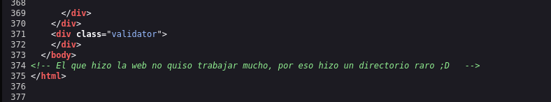

Hay un comentario que nos habla sobre la existencia de un directorio raro, tal vez el archivo *anon.txt* nos pueda dar otra pista.

Bajamos el archivo *anon.txt*.

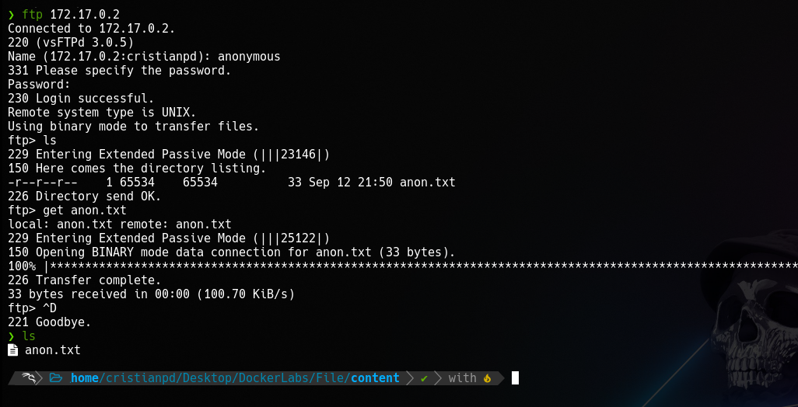

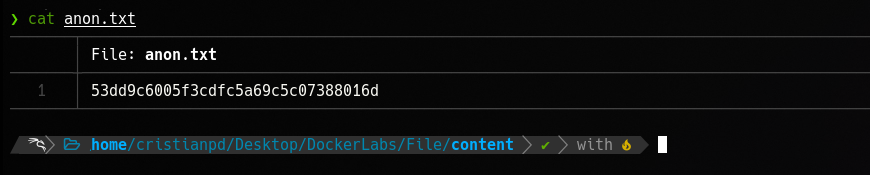

Dentro del archivo hay una cadena de numeros y algunas letras(muy similar a un **hash**).

con `hashid` intento determinar si es un hash y que tipo de hash es.

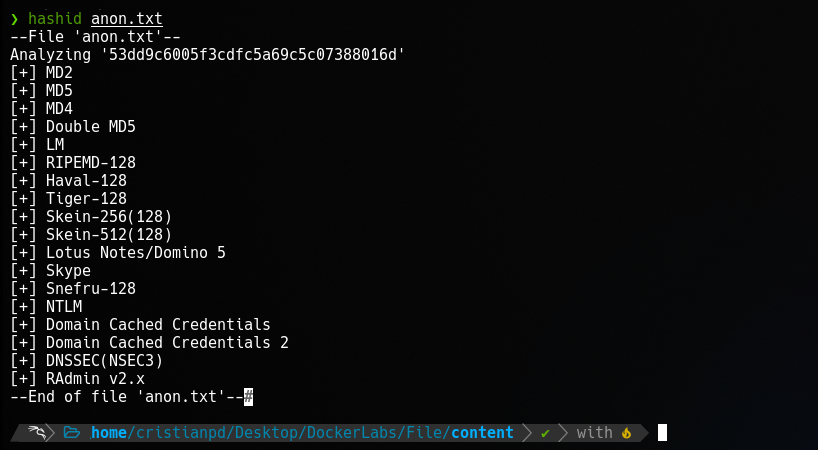

Todo apunta a que probablemente sea un *hash MD5*.

Al intentar romper el hash con `john` indicandole que es un hash md5, nos da el siguiente resultado.

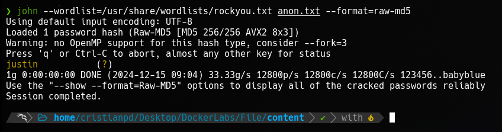

justin?. Posiblemente sea algun usuario o no lo se pero si recordamos el comentario de la web, nos hablaba sobre un directorio asi que, es hora de hacer un poco de fuzzing con `gobuster`.

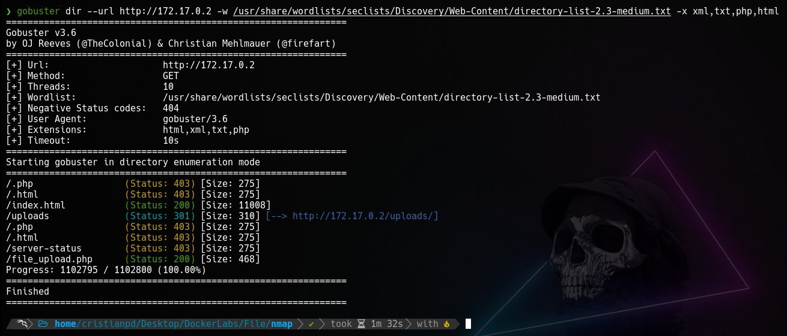

`gobuster` nos encuntra un directorio **uploads** y un archivo *php* llamado **file_upload.php**. Si nos dirijimos a la ruta del archivo *php* podremos ver que tenemos la posibilidad de subir archivos a la maquina, y los cuales, parece que seran almacenados en la carpeta **uploads**.

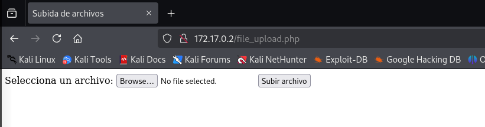

Podemos intentar subir un archivo malicioso con el cual podremos ejecutar comandos dentro de la maquina.

## Explotacion
Despues de intentar de varias maneras el subir un archivo malicioso, he logrado colar un archivo *php* bajo la extension de archivo ***.phar***, que es otra extension de archivo referente a un archivo *php*. En este archivo lo que hacemos es crear una variable llamada `cmd` a la cual le podremos pasar como valor algun comando y que este sea ejecutado a nivel de sistema y que, el resultado del comando, nos lo muestre en la web.

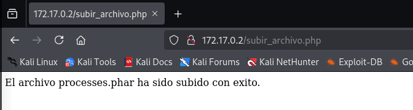

> Es de mencionar que la web solo permite la subida de archivos *.phar* porque al intentar colar imagenes daba error, al igual que con otras extensiones de archivos.

Si revisamos el directorio **uploads**, efectivamente, ahi esta nuestro archivo.

Ahora nos dirijimos hacia la ruta de nuestro archivo dentro del servidor y hacemos un llamado a la variable `cmd` con el valor/comando `id`. Esto nos regresa el siguiente resultado.

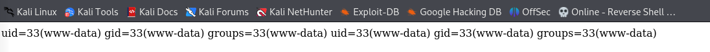

Esto tambien nos indica de que podriamos intentar entablar una revershell hasia nuestra maquina atacante atravez de nuestro archivo *.phar*.

Nos ponemos en escucha con `netcat` por el puerto **443** y le pasamos a la variable `cmd` lo necesario para enviar la conexion a nuestra maquina atacante por el mismo puerto de escucha que `netcat` y enviamos la solicitud.

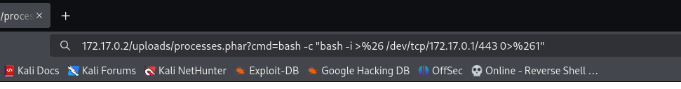

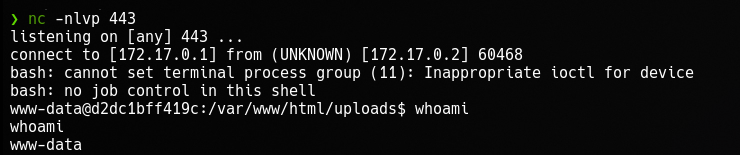

Estamos dentro.

## Escalada de Privilegios
Despues de intentar de varias maneras para poder escalar mis privilegios sin nigun exito, me decidi por usar fuerza bruta para poder ganar acceso como alguno de los usuarios que estaban dentro de la maquina los cuales se encuentran en el `/etc/passwd`.

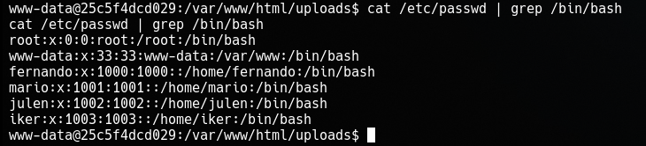

Despues de crear el script con el cual llevaria acabo el ataque([ver script](https://github.com/Crisstianpdx/Su-Force)), lo movi junto con el diccionario *rockyou.txt* hasia la maquina victima.
Me fui directo a usarla sobre el usuario *mario* y al parecer me encontro la contraseña.

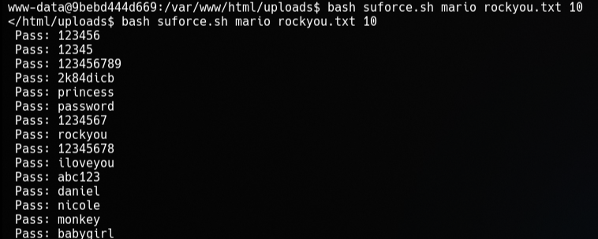

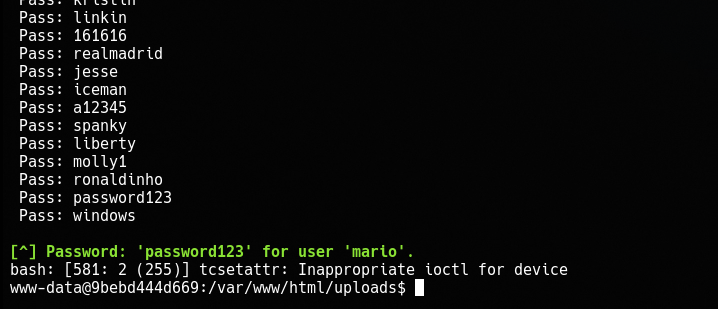

Nos autenticamos como **mario** y vemos con `sudo -l` que comandos podemos ejecutar con privilegios sin contraseña.

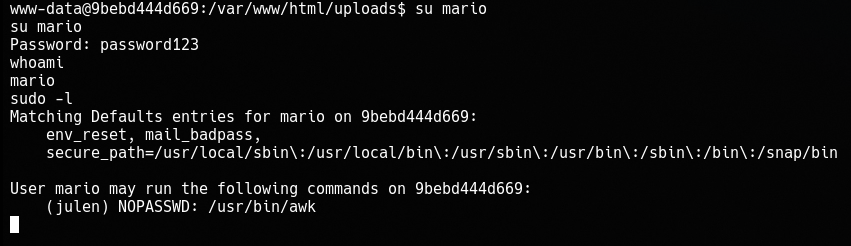

Podemos ejecutar el comando `awk` bajo el usuario *julen* por lo que hay que usarlo.

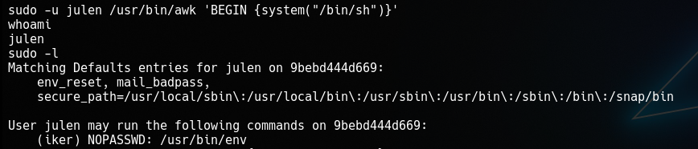

Ahora ganamos una shell como el usuario **julen** y si vemos que comandos podemos ejecutar con privilegios, obervamos que podemos usar del comando `env` bajo el usuario *iker* por lo que, tambien lo usamos.

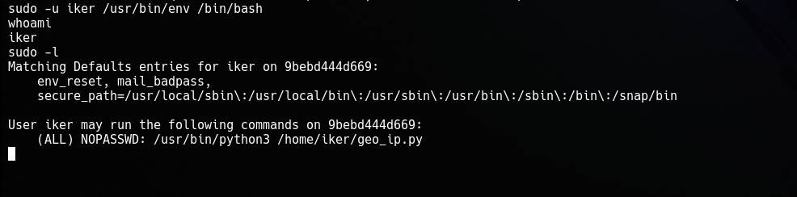

Al ganar una shell como el usuario *iker*, al cual tambien le revisamos los comandos que puede ejecutar con privilegios nos encontramos con que puede ejcutar como cualquier usuario un script python llamado *geo_ip.py* ubicado en su directorio de usuario(*/home/iker*) por lo que ahora solo nos queda abusar de este permiso en ese archivo.

Viendo la ruta */home/iker/* para posibles vectores de explotacion me encontre con otro directorio llamado *\__pycache__* que contenia un archivo *.pyc* con el que poco se me ocurrio que hacer.

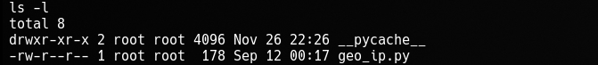

Despues de pensar un poco decido intentar reemplazar el script *geo_ip.py* por mi script *geo_ip.py.1* que contendra las instrucciones necesarias para ejecutarme una /bin/bash como **root**.

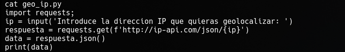

Esto solo consistiria en renombrar los archivos. Renombrar *geo_ip.py* a cualquier otro nombre y mi archivo *geo_ip.py.1* renombrarlo con el nombre *geo_ip.py*(solo quitando el *.1*), de esta forma se ejecutarian mis instrucciones con altos privilegios y ganaria una shell como **root**.

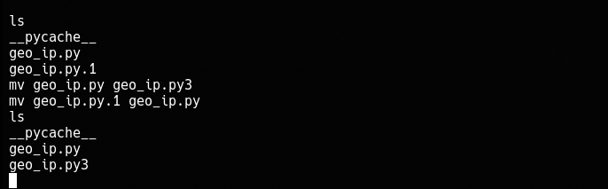

Ahora hay que probarlo.

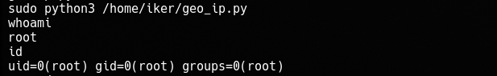

Y ya somos **root**, y tal parece que *justin* del archivo *anon.txt* no sirvio de nada.
