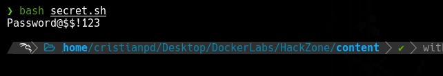

>[Maquina](https://mega.nz/file/CdFVBKgb#fYIZ1IRaYjzVjrjmGOzODDquAul8U-wiFpy8Bu2vBA4)   \   [Dockerlabs](https://dockerlabs.es/)

## Reconocimiento

Comenzamos haciendo un escaneo con `nmap` sobre todos los puertos de la maquina para determinar cuales se encuentran abiertos.

`Nmap` determina que el puerto **22**, **53** y **80** se encuentra abiertos.
El puerto `22` corresponde a un servico *ssh*, el puerto `53` corresponde a un servicio de nombres de dominio, y el puerto `80` corresponde a un servicio *http*(servicio web).

Ahora efectuamos un segundo escaneo con `nmap` para reconocer y determinar versiones de los servicios que corren dentro de estos puertos.

Bueno de primeras parece que podriamos visualizar algo si ingresamos a la ip de la maquina atraves de nuestro navegador web ya que no se esta aplicando un redirect a algun dominio en especifico pero, si vemos el titulo de la web vemos que dice 'hackzones.hl' que tiene toda la pinta de ser un dominio.

Si vemos la web sin contemplar el 'hackzones.hl' en el */etc/hosts* la verdad es que no vemos nada interesante.

Si contemplamos nuestro posible dominio en el */etc/hosts/* se nos muestra una web diferente.

Es un panel de login que se ve un poco pusi.
Si efectuamos un poco de fuzzing con `gobuster` logramos ver que tenemos acceso a un index html llamado *dashboard* y otras cosas un tanto interesantes como el directorio *uploads/*.

## Explotacion

Inspeccionando un poco el *dashboard.html* podemos ver que tenemos la posibilidad de subir una foto que quedaria establecida como nuestra foto de perfil como el usuario admin.

A la pagina se ve que le han dedicado muy poco tiempo de trabajo asi que es probable que no aplique algun tipo de validacion con respecto a lo que se suba como "foto".

Intentaremos subir un archivo php, asi sin mas, el cual nos permita ejecutar comandos a nivel de sistema atraves del parametro `cmd` que ira en el codigo.

Bueno, parece que no hubo problemas.

El archivo parece que se ha subido en el directorio *uploads/* que habiamos encontrado anteriormente asi que si llamamos a nuestro script y le pasamos al parametro `cmd` el valor/comando *whoami* podemos ver que se nos regresa la salida correspondiente al comando por lo que tenemos ejecucion remota de comandos.

Ahora solo nos queda entablar una revershell.

Y estamos dentro.

## Escalada de Privilegios

Buscando un poco entre los archivos nos encontramos en el directorio */var/www/html/* un directorio un tanto curioso que contiene un archivo */secret.sh*.

Si lo intentamos ejecutar nos dice que tenemos que hacerlo como root.
Este archivo me lo envio ha mi maquina para poderlo manipular de manera local.

Parece que este script lo que hace es descodificar algo asi que vamos a ejecutarlo.

Este script nos regresa una contraseña la cual probablemente podriamos usar para conectarnos via ssh pero, nos falta un usuario.

Revisando el */etc/passwd* vemos un usuario de nombre *mrrobot* asi que intentaremos conectarnos como este usuario via ssh.

Y para dentro.

Revisando los permisos *sudoers* del usuario *mrrobot* nos encontramos con la posibilidad de ejecutar el comando `cat` como cualquier usuario asi que vamos a buscar archivos que puedan contener algo interesante que nos ayuden a escalar nuestros privilegios.

Existe un archivo de nombre *SystemUpdate* en el directorio de */opt*, probablemente tenga algo interesante.

Podemo ver el nombre de *root* a la par de la que parece ser una credencial. Podemos intentar usarla.

Bueno, que les digo.
