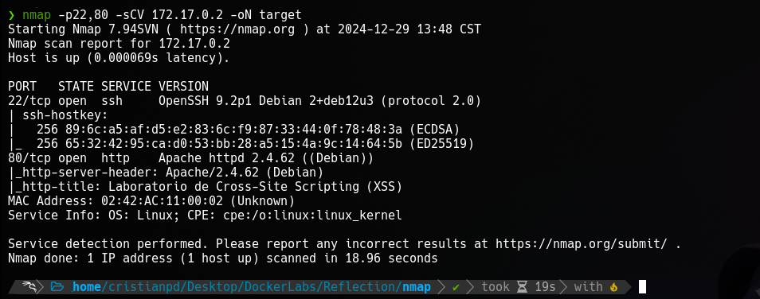
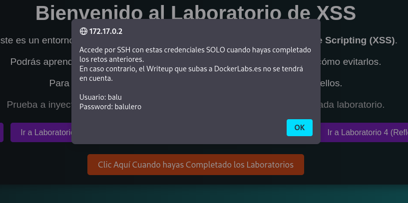
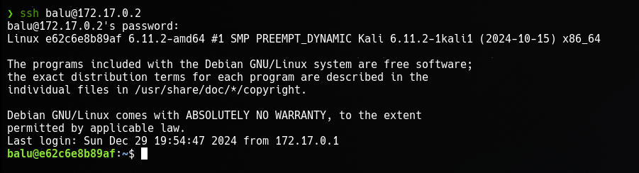
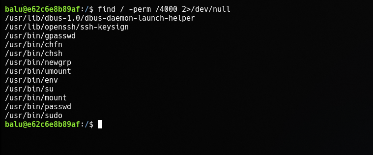
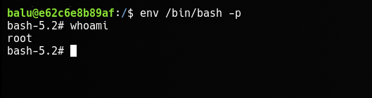
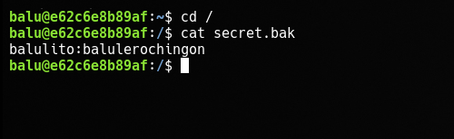

>[Maquina](https://mega.nz/file/SAtzAKLL#3ITizYrmaj4-aP1AyjuzHGMoZuSGeiO8lcfIMBOzaqk)   \   [Dockerlabs](https://dockerlabs.es/)

## Reconocimiento

Comenzamos haciendo un escaneo con `nmap` sobre todos los puertos de la maquina para determinar cuales se encuentran abiertos.

`Nmap` determina que el puerto **22** y **80** se encuentra abiertos.
El puerto `22` corresponde a un servico *ssh*, y el puerto `80` corresponde a un servicio *http*(servicio web).

Ahora efectuamos un segundo escaneo con `nmap` para reconocer y determinar versiones de los servicios que corren dentro de estos dos puertos.

Aparentemente no hay nada interesante en los resultados del escaneo asi que procedemos a analizar la pagina web alojada en el puerto `80`.

## Explotacion?

Analizando un poco los "laboratorios" y la web en si, parece que es solo una web estatica pero, al hacer clic en el boton anaranjado del comienzo, nos lanza una alerta con unas credenciales con las cuales podemos intentar conectarnos via *ssh* a la maquina.

Nose ni cual fue la explotacion aqui pero bueno, igual pongo el titulo.

## Escalada de Privilegios

Si buscamos por binarios con permisos SUID nos econtramos con que el binario `env` posee este permiso por lo que podriamos ejecutarnos una `bash` con altos privilegios pasandole el parametro `-p` al binario `env`.

Y somos root pero, tambien hay otra alternativa.

#### Forma 2

Si revisamos el */etc/passwd* nos encontramos con la existencia de otro usuario de nombre **balulito**, y en la ruta raiz hay un archivo con las que parecen ser sus credenciales con las cuales nos podriamos convertir en dicho usuario.

Leyendo sus permisos *sudoers* podemos ver que puede ejecutar el comando `cp` como cualquier usuario y sin proporcionar contraseña asi que, ya sabemos que hacer no?.

Eso es todo, que realista.

Y si, me da wueva hacer los XSS.

Buen dia, tarde o noche.
